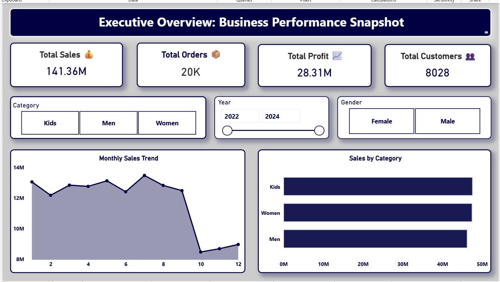
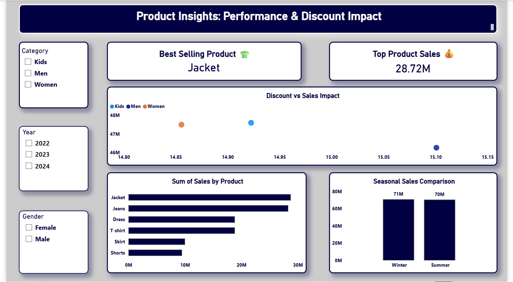
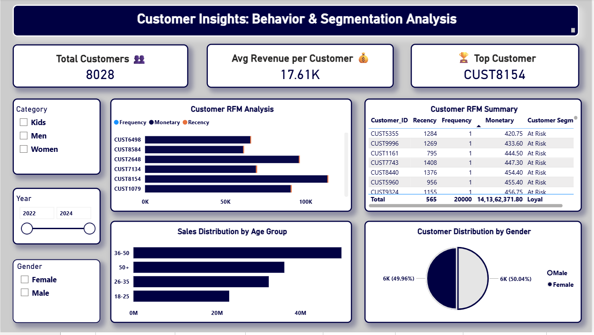
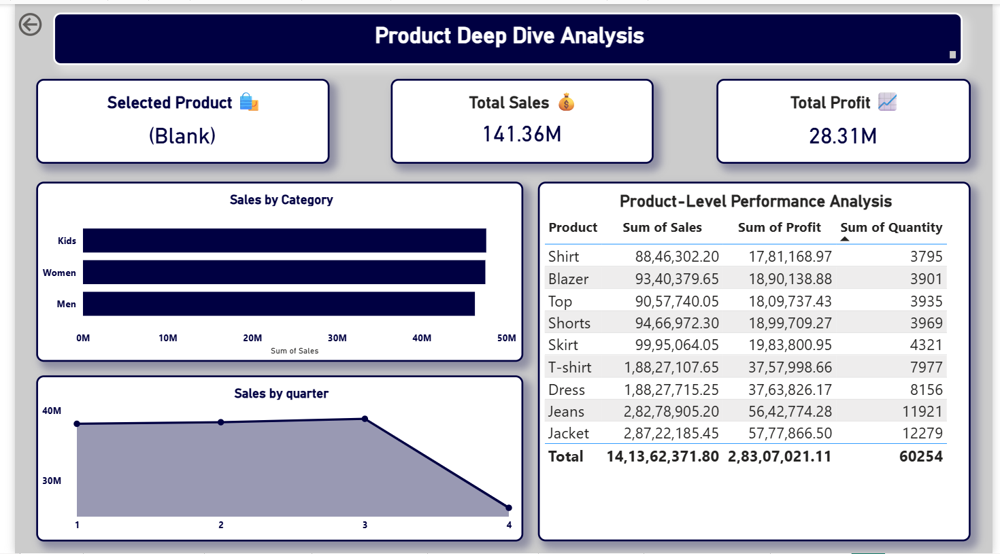
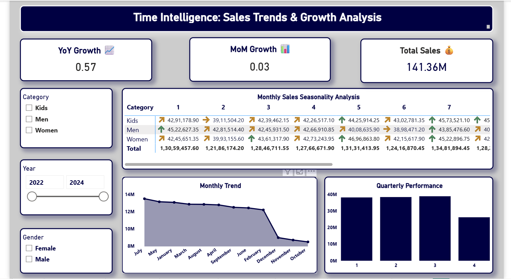
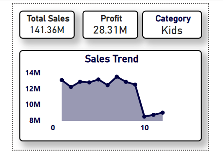

# 👗 Fashion Sales Analytics Dashboard (Power BI)

## 📌 Project Overview

This project is an interactive **Power BI dashboard** designed to analyze fashion sales data, customer behavior, and product performance.

---

## 📷 Dashboard Screens

### 🏠 Executive Overview

### 📊 Product Insights

### 👥 Customer Insights

### 📦 Product Details

### 📅 Date Intelligence

### 📦 Tooltip

---

## 📂 Download Project File

👉 [Download Power BI File (.pbix)](your-link-here)

---

## 🛠 Tools & Technologies

* Power BI
* Data Modeling
* DAX
* Data Visualization

---

## 📊 Key Insights

* 📈 Sales trends over time
* 👥 Customer segmentation
* 🏆 Top-performing products
* 📉 Underperforming categories

---

## 💡 Skills Demonstrated

* Dashboard Design
* Data Analysis
* Business Insights
* Storytelling with Data

---

## 🚀 Business Use Case

Helps businesses:

* Track sales performance
* Understand customer behavior
* Optimize product strategy

---

⭐ If you like this project, feel free to star the repository!
